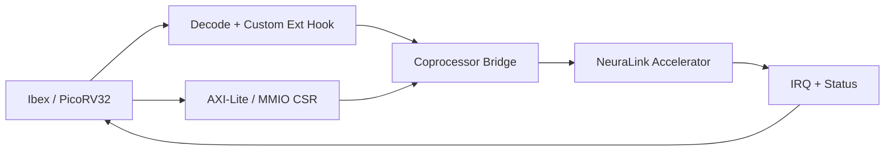

# CPU Selection and Offload Model

## Recommended Primary CPU

Use `Ibex` as the first integration CPU.

Why:

- Mature, well-documented RTL
- Strong verification quality
- Easier coprocessor/MMIO integration path

## Secondary Lightweight Option

Use `PicoRV32` for minimal-area experiments and fast simulation loops.

## Offload Paths

1. MMIO Descriptor Offload (phase-1)
- CPU writes descriptor registers
- CPU rings start doorbell
- Accelerator runs and exposes status/perf

2. Custom Instruction Trigger (phase-2)
- CPU issues custom opcode carrying descriptor pointer or token
- Decoder routes operation to coprocessor bridge
- Lower launch latency, tighter coupling

## Architecture Sketch

## Practical Recommendation

- Start with Ibex + MMIO path for robust bring-up and debug.
- Add custom instruction trigger after baseline correctness and timing closure.
