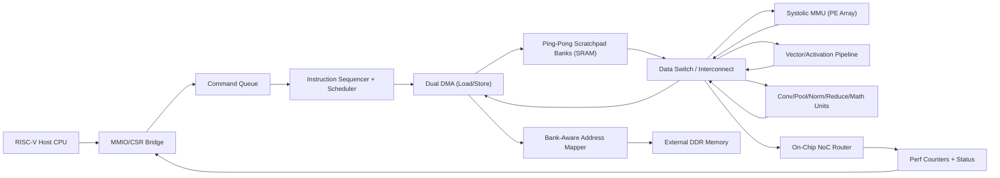
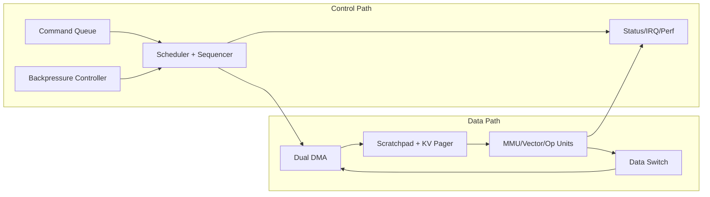

# NeuraLink Full System Architecture

This document defines the current production-style target architecture for NeuraLink.  
It is written to be practical for RTL + verification development, not as a marketing abstraction.

## 1. Top-Level Block Diagram

## 2. Compute Fabric

- `MMU / Systolic array` handles GEMM-heavy tiles and regular dense matrix flows.
- `Vector unit` handles elementwise ops and activation-style approximations.
- `Op units` include conv2d/depthwise, pooling, normalization, reductions, and math approximations.
- `Data switch` selects compute path output based on operation class and dispatch policy.

## 3. Memory Hierarchy

- `DDR` is treated as capacity memory.
- `Dual DMA path` decouples load/store lifecycles.
- `Bank-aware mapper` distributes traffic across banks to reduce hot-spotting.
- `Ping-pong scratchpad control` overlaps transfer and compute.
- `NoC + perf counters` expose movement pressure and contention signatures.

## 4. Control Plane

- `Command queue`: descriptor-based launch model.
- `Decoupled issue controller`: independent load/compute/store progression.
- `Instruction sequencer`: emits per-cycle feed/valid patterns for compute fabric.
- `Perf/status`: done/busy/counters for host-side orchestration and debug.
- `Backpressure controller`: credit-based stall gating under burst pressure.
- `Block sparse scheduler`: deterministic active-block iteration for sparse attention.

## 5. Dataflow Modes

- Weight-stationary for reuse-heavy GEMM/convolution regions.
- Output-stationary for accumulation locality.
- Row-stationary option for balanced movement patterns.

Current selection is descriptor-driven (`tile_desc.mode`) and intended to be tuned by workload.

## 6. Industry-Oriented Design Principles Used

- Explicit stage decoupling (load/compute/store) instead of monolithic control FSM.
- Deterministic command descriptors for repeatable benchmark runs.
- Instrumentation-first philosophy: counters/log paths are first-class.
- Scalable knobs: `ROWS`, `COLS`, memory bank count, op-class route selection.
- Clean module boundaries so block-level replacement is feasible (e.g., better DMA or conv microkernel later).

## 7. Bottlenecks and Mitigations

| Bottleneck | Mitigation In Architecture |
|---|---|
| DDR bandwidth pressure | Bank-aware mapping, ping-pong scratchpad, dual DMA paths |
| Data movement overhead | Scratchpad locality + output-stationary options |
| Compute underutilization | Decoupled issue control, operation-class routing, tiled dispatch |
| Interconnect congestion | Centralized data switch + observable NoC flit counters |
| Pipeline bubbles | Overlap load/compute/store using separate control events |

## 8. Interfaces (Current and Planned)

- Current: script-driven simulation entry and descriptor injection through testbench.
- Next: explicit host-facing MMIO register map and command ring doorbell.
- Planned for FPGA phase: AXI-Lite control + AXI memory master DMA.

## 9. Explicit Control/Data Path Separation

