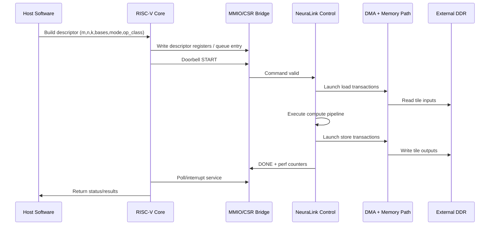

# RISC-V Coprocessor Integration Plan

This document explains how NeuraLink integrates as a coprocessor next to a RISC-V CPU.

Reference RTL module in this repo:

- `rtl/system/riscv_coprocessor_bridge.sv`
- Testbench: `verif/tb/riscv_coprocessor_bridge_tb.sv`

## 1. Integration Model

NeuraLink is treated as an accelerator device controlled by the host CPU.  
Host software prepares descriptors, pushes work, waits for completion, then reads status/counters.

## 2. Control + Execution Flow

## 3. Interface Options

### A. Memory-Mapped IO (recommended first)

- Pros: simple bring-up, debuggable, standard software model.
- Cons: command submission overhead if queue is very small.

Suggested register groups:

- `CTRL`: start, reset, irq_enable
- `STATUS`: busy, done, error
- `DESC0..N`: m/n/k/base pointers/mode/op class
- `PERF`: latency, active, stall, noc flits

### B. Custom Instructions (optional phase)

- Use custom opcode to trigger enqueue/wait operations quickly.
- Keep command descriptors in memory; custom instruction passes pointer.
- Better launch latency, but requires toolchain/compiler path updates.

### C. Accelerator Port (RoCC-like style)

- Tight coupling with CPU decode/issue.
- Good for low-latency command dispatch.
- Higher integration complexity and verification effort.

## 4. Synchronization Strategy

- Default: polling on `STATUS.done` for simplicity.
- Better: interrupt on completion for lower CPU overhead.
- Timeout path must exist to prevent deadlocks in host runtime.

## 5. Software Driver Responsibilities

- Validate descriptor ranges and alignment.
- Program descriptors and ring doorbell.
- Handle completion, error bits, and perf capture.
- Provide blocking and non-blocking submission APIs.

## 6. Verification Targets for CPU + Accelerator Path

- Descriptor decode correctness.
- Busy/done behavior with back-to-back commands.
- DMA completion ordering and store visibility.
- Interrupt generation/clear path.
- Error injection: invalid dimensions, out-of-range base addresses.

## 7. Practical Bring-Up Milestones

1. MMIO register map with single-command execution.
2. Command queue (2-8 deep) with host polling.
3. Interrupt completion path.
4. Optional custom instruction fast-path.
